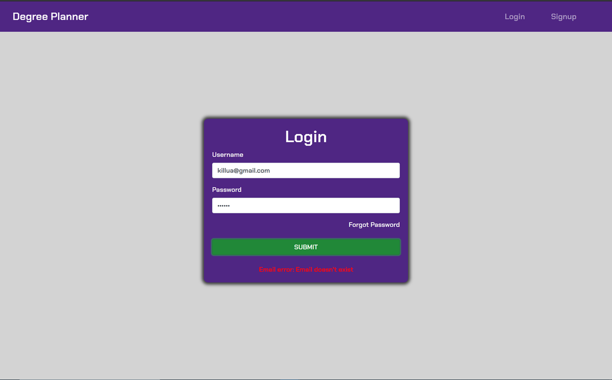
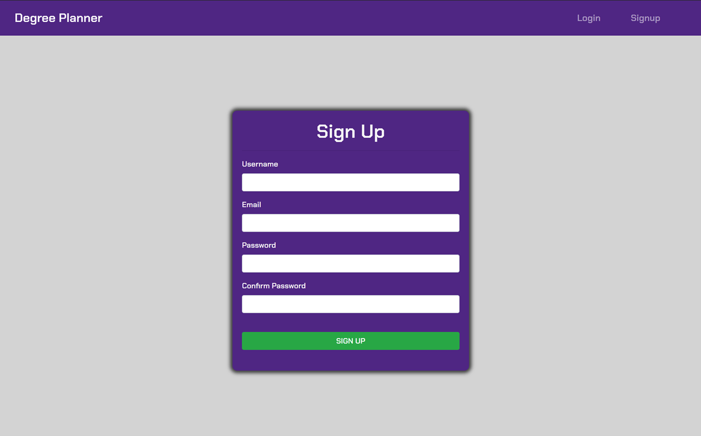
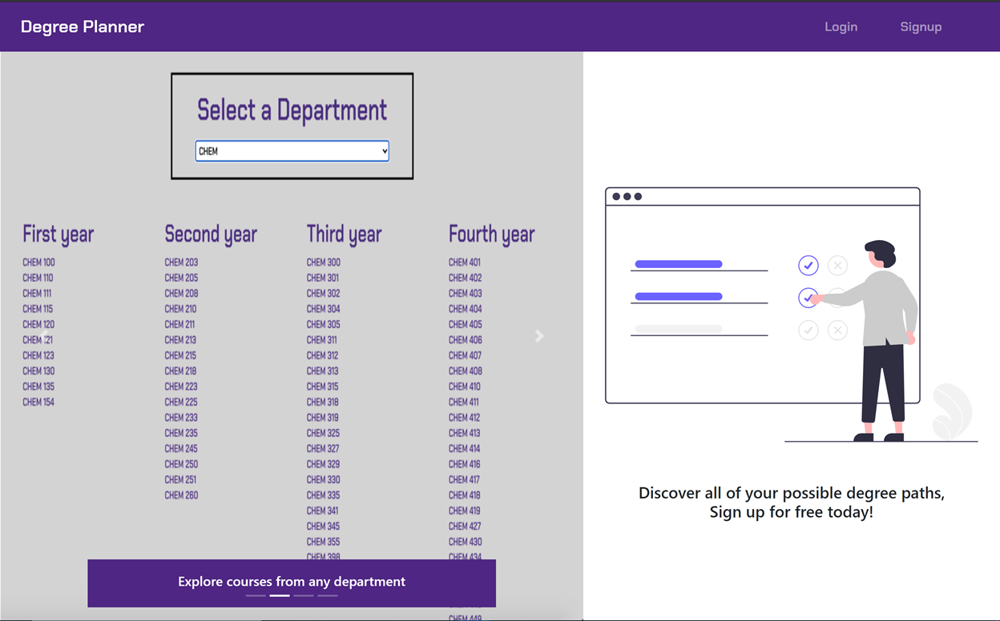
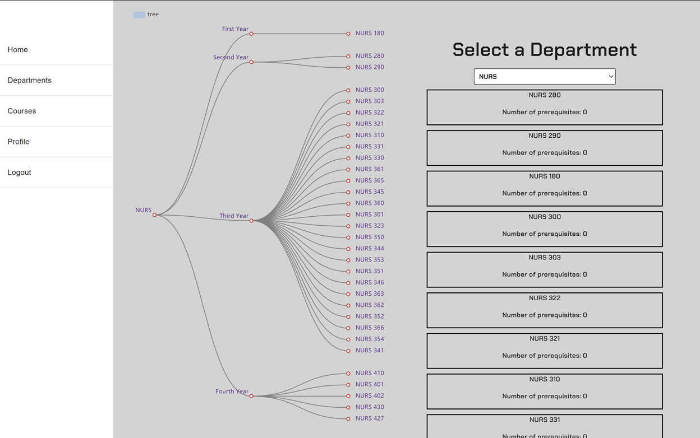
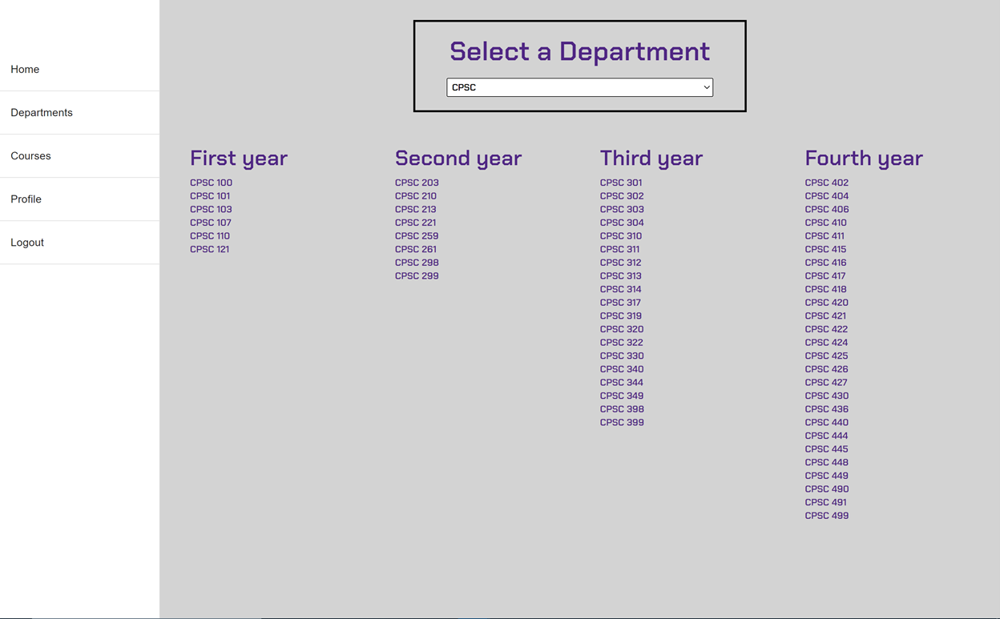
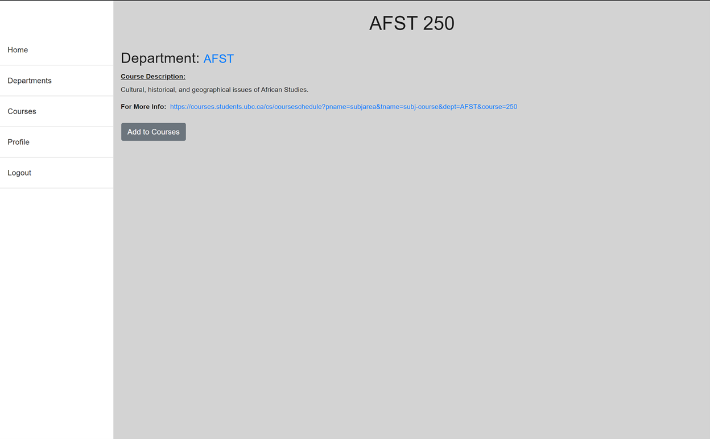
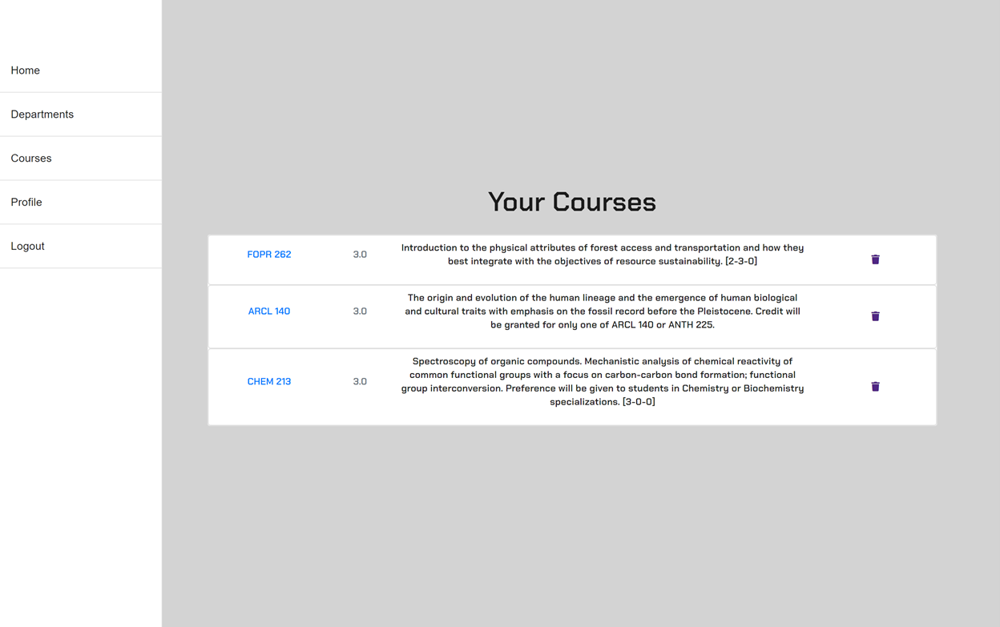
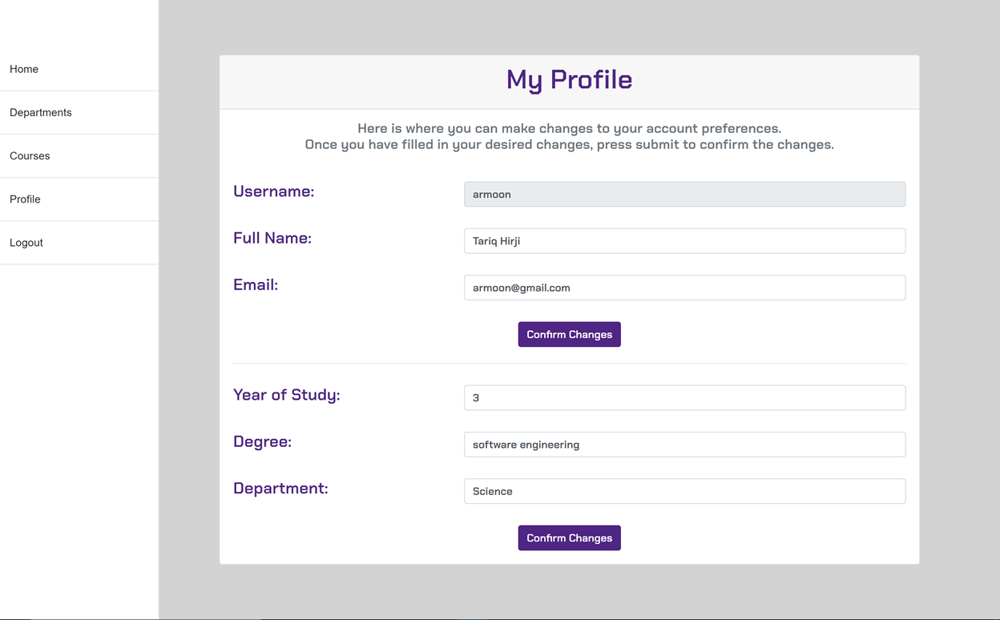

<h1>Degree Planner</h1>

Degree Planner is a web platform that allows students to plan out their degree and evaluate their options. Students can see a dynamic chart that lays out all the necessary courses for a specific program. Degree Planner has access to all courses offered by a student's university. Check out our submission <a href='https://devpost.com/software/degree-planner-m4hdal'>here.</a> 

<h3>Tech Stack</h3>
The frontend uses React,js, Redux, Apache E-Charts, and is stylized using Bootstrap and Material-UI. As for the backend, we used Express.js, Node.js, MongoDB, and Redis. We used a public API to populate our database using courses from the University of British Columbia. 

<h3>Screenshots </h3>

    
Authentication 

    
    

    
Home Page 

    
    

    
Department and Courses 

    
    

    
Profile 

    
    

<h3>Architecture </h3>
The server is modelled using a Model - Controller - Route architecture, and makes use of REST API. The Models allows us to access and update attributes
from the database. The Controller uses Models to execute certain operations as specified by the client. The Route basically allows us to organize each http request
accordingly. 

<h3>Future Plans </h3>
We want to expand our website's scope to include multiple Canadian universities. We also want to add more data visualization tools so that our site is even more user-friendly. Even though we completed a lot of features in less than 36 hours, we still wish that we had more time, because we were just starting to scratch the surface of our website's capabilities.
